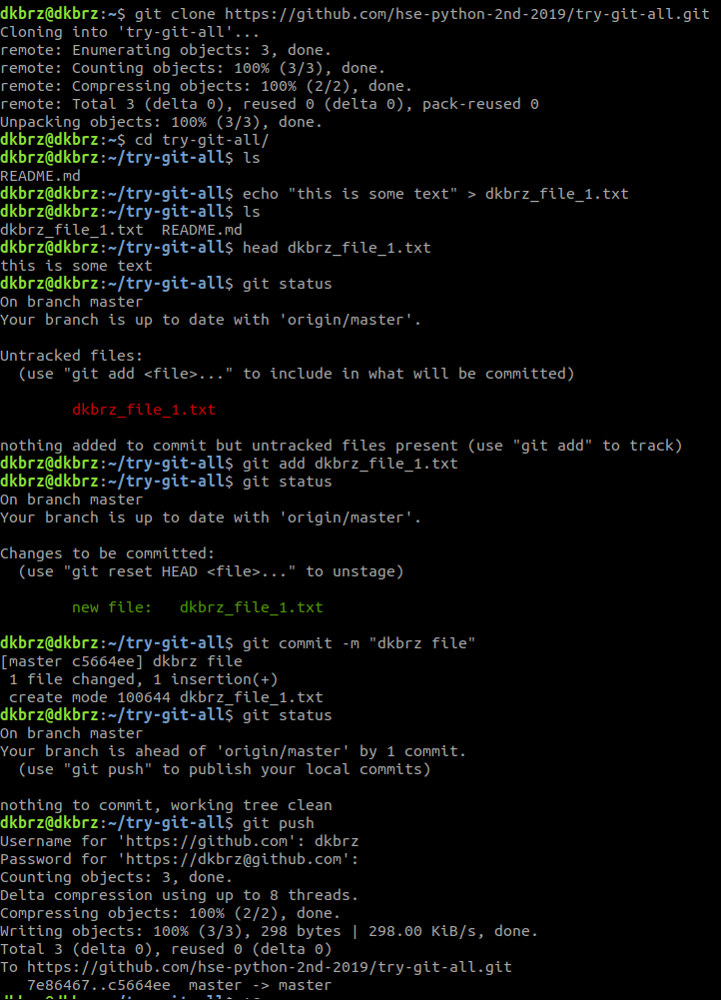

## Git

Консольный гит - это удобнее, чем загружать файлы через upload file на гитхабе, потому что вам проще контролировать что где лежит, не надо думать про файловую структуру, когда вы можете не туда загрузить файл руками.

Стандартные шаги работы

1. Создать репозиторий на гитхабе (руками)
2. Зайти на своем компьютере в терминал (командную строку)
3. Перейти в ту папку, в которую вы хотите с помощью ```cd```
4. Выполнить ```git pull <your-repo>```, например, ```git clone https://github.com/hse-ling-python/seminars.git```
5. Сделать какие-то изменения 
6. Зайти внутрь папки репозитория в командной строке
7. Добавить файлы через ```git add <path-to-your-file>```, например, ```git add 1.txt``` или ```git add some_folder/1.txt```
8. Сделать коммит, то есть зафиксировать изменения в некоторую версию ```git commit -m "<your message here>"```, например, ```git commit -m "add graph"```. Важно не забывать писать сообщение (и про кавычки)
9. Запушить изменения в удаленный репозиторий (на гитхаб) с помощью ```git push```. Скорее всего попросить авторизоваться и ввести пароль. Пароль будет не виден при наборе и это нормально.
10. Чтобы сделать наоборот и скачать изменения себе, нужно зайти в папку и сделать ```git pull```


