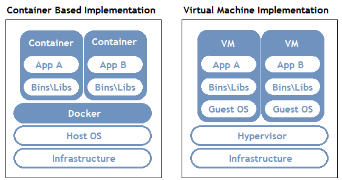
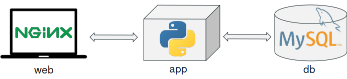
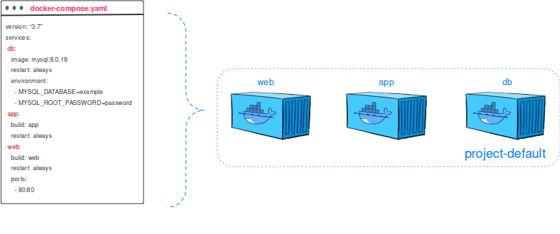
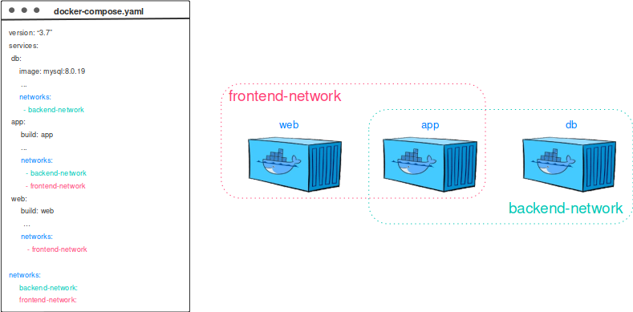

# Теория

## Основные проблемы
- неодинаковость окружений, в которых запускается и работает код. Окружение включает системные библиотеки, версии программного обеспечения, например, версии python, версии установленных модулей python, переменные среды, привилегии пользователя и многое другое
- изоляция работы одного приложения от других. Одна программа может иметь модули python, которые не будут совместимы с версией другой программы. Например. Одна программа требует `pandas>=1.3.0`, а другая `pandas<=0.9.4` , такие программы не могут быть запущены вместе в одном окружении
- настройка окружений на разных рабочих машинах не всегда может быть простым. К примеру, на ноутбуке у вас стоит ubuntu linux в wsl2, а на сервере, на котором стоят GPU и на котором вы хотите запустить расчеты стоит Red Hat. Настройка на разных дистрибутивов Linux будет немного отличаться, в результате настройка окружения займет больше времени
- если у вас очень много рабочих машин, например много серверов, установка на каждый из них необходимые модули python может оказаться очень долгим занятием


## Способы решения
1. использовать универсальный скрипт установки среды (такой скрипт придется писать с учетом разных дистрибутивах Linux, на которых скрипт будет устанавливаться, все усложняя учитываю, что на данный момент 275 дистрибутивов (на момент 2021 года), при этом линукс существует ~30 лет, грубо можно сказать, что на свет появляется около 9 новых дистрибутивов в год)
1. использовать requirements.txt + venv (что делать, если на сервере или на вашей машине  не установлен python, а некоторые библиотеки, например selenium потребует еще установить Java машину)
1. использовать VM VirtualBox - но из-за этого мы можем значительно дольше считать из-за затрат на визуализацию и не всегда будет простой задачей создать VM с выделенным GPU
1. использовать контейнерные технологии, например Docker


## Почему Docker?
Как минимум потому что он лишен большинства минусов всех остальных подходов:
1. docker container привязан только к версии ядра системы Linux, а оно достаточно стабильное. Поэтому столкнуться с проблемами только те приложения, которые не могут корректно работать на определенной версии ядра, что является не частой проблемой и в основном проявляется в каких-то экстремальных случаях, например работы приложения на больших данных или высоконагруженное приложение, чувствительное к задержкам ответа или к безопасности. Чтобы гарантировать повторяемую работу приложения, достаточно чтобы у разных дистрибутивов Linux были одинаковые ядра.
2. docker container может быть запущен с уже предустановленными программами, включая правильные Java машину, модули python и многое другое.
3. С точки нагрузки на GPU/CPU/RAM Docker не добавляет overhead-a
4. Docker стал очень популярным и на данный момент де-факто является стандартом.

Ниже схематично представлена контейнеризация vs виртуализация.
Контейнеризация похоже на виртуализацию, но это не одно и то же. Виртуализация работает как отдельный компьютер, со своим виртуальным оборудованием и операционной системой. При этом внутри одной ОС можно запустить другую ОС. В случае контейнеризации виртуальная среда запускается прямо из ядра основной операционной системы и не виртуализирует оборудование. Это означает, что контейнер может работать только в той же ОС, что и основная. При этом так как контейнеры не виртуализируют оборудование, они потребляют намного меньше ресурсов.

## Архитектура Docker и основные понятия
см [источник](https://eternalhost.net/blog/razrabotka/chto-takoe-docker)

Разработка Docker была начата в 2008 году, а в 2013 году он был опубликован как свободно распространяемое ПО под лицензией Apache 2.0. В качестве тестового приложения Docker был включен в дистрибутив Red Hat Enterprise Linux 6.5. В 2017 году была выпущена коммерческая версия Docker с расширенными возможностями.

Docker работает в Linux, ядро которых поддерживает cgroups, а также изоляцию пространства имен. Для инсталляции и использования на платформах, отличных от Linux, существуют специальные утилиты Kitematic или Docker Machine.

Основной принцип работы Docker — контейнеризация приложений. Этот тип виртуализации позволяет упаковывать программное обеспечение по изолированным средам — контейнерам. Каждый из этих виртуальных блоков содержит все нужные элементы для работы приложения. Это дает возможность одновременного запуска большого количества контейнеров на одном хосте.

Основные понятия:

1. Docker-демон (Docker-daemon) — сервер контейнеров, входящий в состав программных средств Docker. Демон управляет Docker-объектами (сети, хранилища, образы и контейнеры). Демон также может связываться с другими демонами для управления сервисами Docker.
1. Docker-клиент (Docker-client / CLI) — интерфейс взаимодействия пользователя с Docker-демоном. Клиент и Демон — важнейшие компоненты «движка» Докера (Docker Engine). Клиент Docker может взаимодействовать с несколькими демонами.
1. Docker-образ (Docker-image) — файл, включающий зависимости, сведения, конфигурацию для дальнейшего развертывания и инициализации контейнера.
1. Docker-файл (Docker-file) — описание правил по сборке образа, в котором первая строка указывает на базовый образ. Последующие команды выполняют копирование файлов и установку программ для создания определенной среды для разработки.
1. Docker-контейнер (Docker-container) — это легкий, автономный исполняемый пакет программного обеспечения, который включает в себя все необходимое для запуска приложения: код, среду выполнения, системные инструменты, системные библиотеки и настройки.
1. Том (Volume) — эмуляция файловой системы для осуществления операций чтения и записи. Она создается автоматически с контейнером, поскольку некоторые приложения осуществляют сохранение данных.
1. Реестр (Docker-registry) — зарезервированный сервер, используемый для хранения docker-образов. Примеры реестров:

   - Центр Docker — реестр, используемый для загрузки docker-image. Он обеспечивает их размещение и интеграцию с GitHub и Bitbucket.
   - Контейнеры Azure — предназначен для работы с образами и их компонентами в директории Azure (Azure Active Directory).
   - Доверенный реестр Docker или DTR — служба docker-реестра для инсталляции на локальном компьютере или сети компании.
1. Docker-хаб (Docker-hub) или хранилище данных — репозиторий, предназначенный для хранения образов с различным программным обеспечением. Наличие готовых элементов влияет на скорость разработки.
1. Docker-хост (Docker-host) — машинная среда для запуска контейнеров с программным обеспечением.
1. Docker-сети (Docker-networks) — применяются для организации сетевого интерфейса между приложениями, развернутыми в контейнерах.


Преимущества использования Docker
1. Минимальное потребление ресурсов — контейнеры не виртуализируют всю операционную систему (ОС), а используют ядро хоста и изолируют программу на уровне процесса. Последний потребляет намного меньше ресурсов локального компьютера, чем виртуальная машина.
1. Скоростное развертывание — вспомогательные компоненты можно не устанавливать, а использовать уже готовые docker-образы (шаблоны). Например, не имеет смысла постоянно устанавливать и настраивать Linux Ubuntu. Достаточно 1 раз ее инсталлировать, создать образ и постоянно использовать, лишь обновляя версию при необходимости.
1. Удобное скрытие процессов — для каждого контейнера можно использовать разные методы обработки данных, скрывая фоновые процессы.
1. Работа с небезопасным кодом — технология изоляции контейнеров позволяет запускать любой код без вреда для ОС.
1. Простое масштабирование — любой проект можно расширить, внедрив новые контейнеры.
1. Удобный запуск — приложение, находящееся внутри контейнера, можно запустить на любом docker-хосте.
1. Оптимизация файловой системы — образ состоит из слоев, которые позволяют очень эффективно использовать файловую систему.

## Как работают Docker образы

Docker-image — шаблон только для чтения (read-only) с набором некоторых инструкций, предназначенных для создания контейнера. Он состоит из слоев, которые Docker комбинирует в один образ при помощи вспомогательной файловой системы `UnionFS`. Так решается проблема нерационального использования дисковой памяти. Параметры образа определяются в `Docker-file`.
Сборки для базовых образов: alpine, slim, stretch, buster, jessie, bullseye, windowsservercore
Подробнее можно почитать [здесь](https://medium.com/swlh/alpine-slim-stretch-buster-jessie-bullseye-bookworm-what-are-the-differences-in-docker-62171ed4531d).

### Пример Dockerfile с python приложением
```dockerfile
# Возьмем базовый образ python, найти разные версии python и примеры использования можно здесь https://hub.docker.com/_/python.
FROM python:3-alpine

WORKDIR /usr/src/app

COPY requirements.txt ./
RUN pip install --no-cache-dir -r requirements.txt

COPY . .

CMD [ "python", "./your-daemon-or-script.py" ]
```

### Сборка Docker образа с запуском
```bash
# перейдем в директорию с Dockerfile
cd dockerfiles/easy_python_app
# соберем образ на основе Dockerfile из текущей директории
docker build -t easy_python_app . 
# проверим, что приложениее main.py внутри образа отработает
docker run esay_python_app:latest
# получис строку "Hi from container"


```


Для многократного применения Docker-image следует пользоваться реестром образов или Докер-реестром (Docker-registry), позволяющим скачивать готовые образы с внешнего репозитория сервиса и хранить их в реестре Докер-хоста. Рекомендуемый вариант — официальный реестр компании Docker Trusted Registry (DTR), перейти на Docker-Hub можно по [ссылке](https://hub.docker.com/).
## Как работают Docker контейнеры

Каждый контейнер строится на основе Docker-образов. Контейнеры запускаются напрямую из ядра операционной системы Linux. Благодаря этому, они потребляют гораздо меньше ресурсов, чем при аппаратной виртуализации.

Изоляция рабочей среды осуществляется при помощи технологии namespace. Для каждого изолированного пространства (контейнера) создается уникальное пространство имен, которое и обеспечивает к нему доступ. Любой процесс, выполняемый внутри контейнера, ограничивается namespace.
### Что происходит при запуске контейнера

1. Происходит запуск образа (Docker-image). Docker Engine проверяет существование образа.  Если образ уже существует локально, Docker использует его для нового контейнера. При его отсутствии выполняется скачивание с Docker Hub.
1. Создание контейнера из образа.
1. Разметка файловой системы и добавление слоя для записи.
1. Создание сетевого интерфейса.
1. Поиск и присвоение IP-адреса.
1. Запуск указанного процесса.
1. Захват ввода/вывода приложения.
### Запуск контейнера
```bash
# Возьмем базовый образ из docker hub 
# ключи:
# -t, --tty=true|false
# -i, --interactive=true|false
# --rm true|false
docker run -ti --rm python:3.7.4 python
# Python 3.7.4 (default, Oct 17 2019, 05:59:21) 
# [GCC 8.3.0] on linux
# Type "help", "copyright", "credits" or "license" for more information.
# >>> import  sys
# >>> sys.version
# '3.7.4 (default, Oct 17 2019, 05:59:21) \n[GCC 8.3.0]'

```


## Основные команды
Подробное описание [здесь](https://timeweb.com/ru/community/articles/osnovnye-komandy-docker)
### Команды Docker для управления контейнерами
У описанных ниже команд есть общий синтаксис, который выглядит так: `docker container` название команды. Названия, собственно, ниже:

- `create` — создает контейнер из выбранного образа.
- `start` — активирует уже существующий контейнер.
- `run` — создает новый контейнер и сразу включает его.
- `ls` — отображает все существующие контейнеры.
- `inspect` — подробнее рассказывает о выбранном контейнере.
- `logs` — выводит в консоль логи (то есть журнал событий).
- `stop` — пытается остановить выбранный контейнер, отправив ему сигнал SIGTERM, требующий завершить всю активность и сохранить пользовательские данные. Если ответ занимает слишком много времени, то следом посылает сигнал SIGKILL, чтобы «убить» процесс без сохранения данных.
- `kill` — выполняет ту же задачу, что и предыдущая команда, но пропускает шаг с отправкой SIGTERM. Сразу выключает контейнер, игнорируя сохранение пользовательских данных.
- `rm` — удаляет выбранный контейнер (он должен быть выключен, чтобы команда сработала).


### Команды Docker для управления образами

У описанных ниже команд есть общий синтаксис, который выглядит так: `docker image` название команды. Названия, собственно, ниже:

- `build` — собирает образ с нуля.
- `push` — отправляет образ в реестр.
- `pull` — загружает готовый образ с необходимыми для работы параметрами.
- `ls` — показывает все существующие образы.
- `history` — показывает каждый слой образа в ретроспективе, отображая ряд полезных сведений.
- `inspect` — рассказывает все, что известно об образе, включая данные, касающиеся отдельных слоев.
- `rm` — удаляет образ Docker из системы.
- `images` — списком показывает все образы Docker, найденные на диске.

### Прочие команды Docker
Это общие операции, не привязанные к работе с конкретными сущностями типа образов и контейнеров. Но они тоже пригодятся при использовании Docker.

- `docker version` — показывает техническую информацию о самом Docker. Как о клиенте, так и о сервере.
- `docker login` — авторизует пользователя в реестре Docker.
- `docker system prune` — выполняет некую чистку, удалив из системы контейнеры, которые уже не используются, ненужные сети и образы без имен и меток.


# Примеры на наших задачах
Примеры этой секции лежат в  лежат в директории `basic_examples`
## Краулинг с Selenium
Установка и запуск в одну команду selenium
```bash
# Возьмем базовый образ из docker hub 
# ключи:
# -d, --detach=true|false
# -p, --publish ip:[hostPort]:containerPort | [hostPort:]containerPort
# --shm-size=""
docker run -d -p 4444:4444 -p 7890:7900 --shm-size="2g" selenium/standalone-firefox:4.1.0-20211123
```
Порт `4444` для selenium webdriver, порт `7900` для визуализации через браузер работы программы. В случае разработки краулера, проще будет использовать собственный vnc подробное описание доступно на github selenium см [здесь](https://github.com/SeleniumHQ/docker-selenium#debugging).

Чтобы посмотреть результаты работы селениума в браузере надо перейти по адресу `localhost:7890`

Управляем selenium через python:
```python
# %% 
# !pip install selenium
# docker run -d -p 4444:4444 -p 5432:7900 --shm-size="2g" selenium/standalone-firefox:4.1.0-20211123
# %%
import time 
from selenium import webdriver
from selenium.webdriver.common.desired_capabilities import DesiredCapabilities

# %%

driver = webdriver.Remote(
   command_executor='http://127.0.0.1:4444/wd/hub',
   desired_capabilities=DesiredCapabilities.FIREFOX)

# %%


driver.get("https://yandex.ru/")
time.sleep(5)
time.sleep(5)

# %%
driver.get("https://yandex.ru/pogoda/")
# подождем, когда страница загрузится
time.sleep(5)
# получим xpath через инспектор браузера и найдем элемент с погодой в html
temperature = driver.find_element_by_xpath("/html/body/div[1]/div[3]/div[2]/div[1]/div[6]/a/div[1]/span[2]").text
print(f'temperature={temperature}')


```

## База данных postgres
Postgres - это современная база данных.
Установка и запуск в одну команду postgres:
```bash
# Возьмем базовый образ из docker hub 
# ключи:
# --name=""
# -e, --env=[]
# -v|--volume[=[[HOST-DIR:]CONTAINER-DIR[:OPTIONS]]]

docker run -d \
    --name postgres_db \
    -e POSTGRES_PASSWORD=password \
    -e PGDATA=/var/lib/postgresql/data/pgdata \
    -v /tmp/data:/var/lib/postgresql/data \
    -p 5444:5432 \
    postgres
```

Подключение python к базе данных, выполнение запросов.
```python
# %%
# !pip install psycopg2
# %%
import psycopg2
conn = psycopg2.connect(
    host="localhost",
    user="postgres",
    password="password",
    port=5444
    )

# %%
cur = conn.cursor()
cur.execute('SELECT version()')
cur.fetchone()
# %%
cur.execute('SELECT 1')
cur.fetchone()
# %%

```

## Статический вебсайт на nginx
Про конфигурацию nginx см. [здесь](https://hub.docker.com/_/nginx)
```bash
# Возьмем базовый образ из docker hub 

docker run -d -p 8080:80 -v ${PWD}/data:/usr/share/nginx/html:ro nginx
```
# Продвинутая практика
## docker-compose/docker compose
Как `docker` может управлять отдельно взятым контейнером, так `docker-compose` помогает управлять не просто одним, а всеми контейнерами, которые составляют распределенное приложение. Причём, не только контейнерами, но и сетями, подключенными директориями и всеми связанными с этим настройками.

Есть 2 версии `docker-compose`, версия v1 написанная на python и устанавливается отдельно от `docker`. Версия v2 написана над Golang как и `docker` и распространяется вместе с новыми версиями `docker`.
Пример вызова отдельно установленного `docker-compose` v1:
```bash
docker-compose --version
# docker-compose version 1.29.2, build 5becea4c

```
Пример вызова `docker-compose` v2, распространяемого вместе с новыми версиями `docker`:
```bash
docker --version
# Docker version 20.10.9, build c2ea9bc90b

docker compose --help
# Docker Compose

# Options:
#       --ansi string                Control when to print ANSI control characters ("never"|"always"|"auto") (default "auto")
#       --compatibility              Run compose in backward compatibility mode
#       --env-file string            Specify an alternate environment file.
#   -f, --file stringArray           Compose configuration files
#       --profile stringArray        Specify a profile to enable
#       --project-directory string   Specify an alternate working directory
#                                    (default: the path of the Compose file)
#   -p, --project-name string        Project name

# Commands:
#   build       Build or rebuild services
#   convert     Converts the compose file to platform's canonical format
#   cp          Copy files/folders between a service container and the local filesystem
#   create      Creates containers for a service.
#   down        Stop and remove containers, networks
#   events      Receive real time events from containers.
#   exec        Execute a command in a running container.
#   images      List images used by the created containers
#   kill        Force stop service containers.
#   logs        View output from containers
#   ls          List running compose projects
#   pause       pause services
#   port        Print the public port for a port binding.
#   ps          List containers
#   pull        Pull service images
#   push        Push service images
#   restart     Restart containers
#   rm          Removes stopped service containers
#   run         Run a one-off command on a service.
#   start       Start services
#   stop        Stop services
#   top         Display the running processes
#   unpause     unpause services
#   up          Create and start containers

# .

```
## Многосервисный проект на docker compose
Подробнее о проекте можно посмотреть [здесь](https://www.docker.com/blog/containerized-python-development-part-2/).
Проект будет состоять из 3-х сервисов показанных ниже:

### Описание проекта с использованием docker compose
Файлы в директории проекта:
```
Project
├─── docker-compose.yml
├─── web
├─── app
│ ├─── Dockerfile
│ ├─── requirements.txt
│ └─── src
│ └─── server.py
└─── db
```
То, как `docker-compose` будет конфигурировать сервисы в описывается файлом `docker-compose.yaml`/`docker-compose.yml`.
Рассмотрим `docker-compose.yml` этого проекта:

```yml
version: "3.7" # версия описания d-c , см другие версии https://docs.docker.com/compose/compose-file/
# ключ, который содержит все сервисы, которые будут разворачиваться
services:
  db:
    # базовый образ из docker hub
    image: mysql:8.0.19
    # команда, которая отработает после разворачивании контейнера
    command: '--default-authentication-plugin=mysql_native_password' 
    # если контейнер завершиться с ошибкой, тогда необходимо будет переподнять его
    restart: always
    # переменные среды, которые будут переданы в контейнер
    environment:
      - MYSQL_DATABASE=example
      - MYSQL_ROOT_PASSWORD=password

  app:
    # образ, из которого будет создаваться контейнер будет собираться на основе Dockerfile из директории ./app
    build: app
    restart: always

  web:
    build: web
    restart: always
    # Порты, которые будут отображать из контейнера на хостовую машину.
    ports:
      - 80:80
```
### Разделение проекта на разные сети
В нашем предыдущем варианте проект находится в одной сети (network) контейнеров:



Можно разделить видимости сети в зависимости от сервисов:



# Продвинутые примеры
Примеры этой секции лежат в директории `advance_examples`, от простого к сложному `flask`, `flask-postgres`, `flask-postgres-nginx`

Исходные проекты можно найти [здесь](https://github.com/brandonserna/flask-docker-compose), [здесь](https://github.com/mehemken/docker-flask-postgres) и [здесь](https://github.com/normanwongcl/docker-flask).
