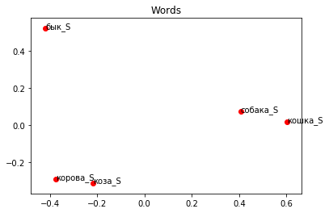
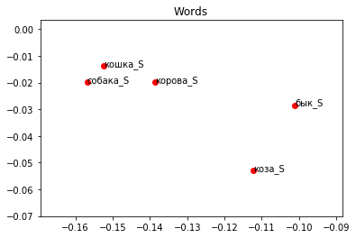

# Векторные модели. Word2Vec

Мы уже работали с грамматикой — в автоматическом кодировании грамматических категорий, кажется, ничего сверхъестественного нет. Но можно ли как-то закодировать значение слова? Да! В этом нам поможет лингвистическая теория, которая называется дистрибутивной гипотезой. Она утверждает, что значение слова определяется его контекстом — иначе говоря, словами, которые встречаются рядом с этим словом в тексте. Область лингвистики, которая занимается вычислением степени семантической близости между словами/текстами и т.п. на основании их распределения (дистрибуции) в больших массивах данных (текстовых корпусах) назвается **дистрибутивной семантикой**.

## Кратко о существующих системах

**GloVe**

GloVe берет и строит полную матрицу совместной встречаемости и после этого с помощью алгоритомв уменьшения размерности преобразует ее так, чтобы вектора были опредленной длины


**Word2Vec**

Это уже нейросеть и она на основе корпуса постепенно подбирает коэффициенты (значения в векторах) для каждого слова так, чтобы с помощью них можно было наилучшим образом предсказывать слова по контексту

**FastText**

Если мы берем конкретные слова, мы не можем ничего сказать о тех, что нам не встретились (например, уже видели вагон и строитель, а вот вагоностроителя у нас не было). Если мы возьмем слова не целиком, а в виде будквенных нграмм, то мы сможем сложить неизвестные слова.

**AdaGram**

Все предыдущие модели основаны на графических оболочках и не учитывают многозначность и омонимию. Есть только один вектор для слова "ключ" и мы ничего с этим не можем сделать. AdaGram исходит из предположения, что у слова есть n вариантов и если они действительно отличаются и достаточно часто встречаются, он умеет их разделить.

**BERT и ELMo**

Эти модели не просто могут отличить значения слов, о и скорректировать их вектора в зависимости от контекста, например, понять, что в отрывках “чистый ключ в лесной чаще” и “ключ от квартиры” совсем разные “ключи”. 

### Word2Vec

Одной из самых известных моделей для работы с дистрибутивной семантикой является word2vec. Технология основана на нейронной сети, предсказывающей вероятность встретить слово в заданном контексте. Этот инструмент был разработан группой исследователей Google в 2013 году, руководителем проекта был Томаш Миколов (сейчас работает в Facebook). Вот две самые главные статьи:

+ [Efficient Estimation of Word Representations inVector Space](https://arxiv.org/pdf/1301.3781.pdf)
+ [Distributed Representations of Words and Phrases and their Compositionality](https://arxiv.org/abs/1310.4546)

Полученные таким образом вектора называются распределенными представлениями слов, или **эмбеддингами**.

#### Как это обучается?

Мы задаём вектор для каждого слова с помощью матрицы $w$ и вектор контекста с помощью матрицы $W$. По сути, word2vec является обобщающим названием для двух архитектур Skip-Gram и Continuous Bag-Of-Words (CBOW).

+ **CBOW** предсказывает текущее слово, исходя из окружающего его контекста.

+ **Skip-gram**, наоборот, использует текущее слово, чтобы предугадывать окружающие его слова.

#### Как это работает?

Word2vec принимает большой текстовый корпус в качестве входных данных и сопоставляет каждому слову вектор, выдавая координаты слов на выходе. Сначала он создает словарь, «обучаясь» на входных текстовых данных, а затем вычисляет векторное представление слов. Векторное представление основывается на контекстной близости: слова, встречающиеся в тексте рядом с одинаковыми словами (а следовательно, согласно дистрибутивной гипотезе, имеющие схожий смысл), в векторном представлении будут иметь близкие координаты векторов-слов. Для вычисления близости слов используется косинусное расстояние между их векторами.

С помощью дистрибутивных векторных моделей можно строить семантические пропорции (они же аналогии) и решать примеры:

+ король: мужчина = королева: женщина $\Rightarrow$
+ король - мужчина + женщина = королева


Ещё про механику с картинками [тут](https://habr.com/ru/post/446530/)

#### Зачем это нужно?

+ используется для решения семантических задач
+ давайте подумаем, для описания каких семантических классов слов дистрибутивная информация особенно важна?
+ несколько интересных статей по дистрибутивной семантике:

* [Turney and Pantel 2010](https://jair.org/index.php/jair/article/view/10640)
* [Lenci 2018](https://www.annualreviews.org/doi/abs/10.1146/annurev-linguistics-030514-125254?journalCode=linguistics)
* [Smith 2019](https://arxiv.org/pdf/1902.06006.pdf)
* [Pennington et al. 2014](https://www.aclweb.org/anthology/D14-1162/)
* [Faruqui et al. 2015](https://www.aclweb.org/anthology/N15-1184/)

+ подаётся на вход нейронным сетям
+ используется в Siri, Google Assistant, Alexa, Google Translate...

#### Gensim

Использовать предобученную модель эмбеддингов или обучить свою можно с помощью библиотеки `gensim`. Вот ее [документация](https://radimrehurek.com/gensim/models/word2vec.html). Вообще-то `gensim` — библиотека для тематического моделирования текстов, но один из компонентов в ней — реализация на python алгоритмов из библиотеки word2vec (которая в оригинале была написана на C++).

Если gensim у вас не стоит, то ставим: `pip install gensim`. Можно сделать это прямо из jupyter'а! Чтобы выполнить какую-то команду не в питоне, в командной строке, нужно написать перед ней восклицательный знак.


```python
import re
import gensim
import logging
import nltk.data
import pandas as pd
import urllib.request
from bs4 import BeautifulSoup
from nltk.corpus import stopwords
from gensim.models import word2vec

import warnings
warnings.filterwarnings('ignore')
```

    C:\ProgramData\Anaconda3\lib\site-packages\smart_open\ssh.py:34: UserWarning: paramiko missing, opening SSH/SCP/SFTP paths will be disabled.  `pip install paramiko` to suppress
      warnings.warn('paramiko missing, opening SSH/SCP/SFTP paths will be disabled.  `pip install paramiko` to suppress')
    

#### Как обучить свою модель

NB! Обратите внимание, что тренировка модели не включает препроцессинг! Это значит, что избавляться от пунктуации, приводить слова к нижнему регистру, лемматизировать их, проставлять частеречные теги придется до тренировки модели (если, конечно, это необходимо для вашей задачи). Т.е. в каком виде слова будут в исходном тексте, в таком они будут и в модели.

Поскольку иногда тренировка модели занимает много времени, то можно ещё вести лог событий, чтобы понимать, что на каком этапе происходит.


```python
logging.basicConfig(format='%(asctime)s : %(levelname)s : %(message)s', level=logging.INFO)
```

На вход модели даем текстовый файл, каждое предложение на отдельной строчке. Вот игрушечный пример с текстом «Бедной Лизы». Он заранее очищен от пунктуации, приведен к нижнему регистру и лемматизирован.


```python
f = 'liza_lem.txt'
data = gensim.models.word2vec.LineSentence(f)
```

Инициализируем модель. Основные параметры:

+ данные должны быть итерируемым объектом
+ size — размер вектора,
+ window — размер окна наблюдения,
+ min_count — мин. частотность слова в корпусе,
+ sg — используемый алгоритм обучения (0 — CBOW, 1 — Skip-gram),
+ sample — порог для downsampling'a высокочастотных слов,
+ workers — количество потоков,
+ alpha — learning rate,
+ iter — количество итераций,
+ max_vocab_size — позволяет выставить ограничение по памяти при создании словаря (т.е. если ограничение привышается, то низкочастотные слова будут выбрасываться). Для сравнения: 10 млн слов = 1Гб RAM.


```python
%time model_liza = gensim.models.Word2Vec(data, size=300, window=5, min_count=2, iter=20)
```

    2019-10-17 20:34:43,388 : INFO : collecting all words and their counts
    2019-10-17 20:34:43,396 : WARNING : this function is deprecated, use smart_open.open instead
    2019-10-17 20:34:43,407 : INFO : PROGRESS: at sentence #0, processed 0 words, keeping 0 word types
    2019-10-17 20:34:43,415 : INFO : collected 1213 word types from a corpus of 3109 raw words and 392 sentences
    2019-10-17 20:34:43,420 : INFO : Loading a fresh vocabulary
    2019-10-17 20:34:43,427 : INFO : effective_min_count=2 retains 478 unique words (39% of original 1213, drops 735)
    2019-10-17 20:34:43,431 : INFO : effective_min_count=2 leaves 2374 word corpus (76% of original 3109, drops 735)
    2019-10-17 20:34:43,439 : INFO : deleting the raw counts dictionary of 1213 items
    2019-10-17 20:34:43,441 : INFO : sample=0.001 downsamples 83 most-common words
    2019-10-17 20:34:43,445 : INFO : downsampling leaves estimated 1817 word corpus (76.6% of prior 2374)
    2019-10-17 20:34:43,450 : INFO : estimated required memory for 478 words and 300 dimensions: 1386200 bytes
    2019-10-17 20:34:43,458 : INFO : resetting layer weights
    2019-10-17 20:34:43,482 : INFO : training model with 3 workers on 478 vocabulary and 300 features, using sg=0 hs=0 sample=0.001 negative=5 window=5
    2019-10-17 20:34:43,496 : WARNING : this function is deprecated, use smart_open.open instead
    2019-10-17 20:34:43,528 : INFO : worker thread finished; awaiting finish of 2 more threads
    2019-10-17 20:34:43,534 : INFO : worker thread finished; awaiting finish of 1 more threads
    2019-10-17 20:34:44,419 : INFO : worker thread finished; awaiting finish of 0 more threads
    2019-10-17 20:34:44,424 : INFO : EPOCH - 1 : training on 3109 raw words (1817 effective words) took 0.9s, 2001 effective words/s
    2019-10-17 20:34:44,434 : WARNING : this function is deprecated, use smart_open.open instead
    2019-10-17 20:34:44,479 : INFO : worker thread finished; awaiting finish of 2 more threads
    2019-10-17 20:34:44,484 : INFO : worker thread finished; awaiting finish of 1 more threads
    2019-10-17 20:34:45,508 : INFO : EPOCH 2 - PROGRESS: at 100.00% examples, 1711 words/s, in_qsize 0, out_qsize 1
    2019-10-17 20:34:45,513 : INFO : worker thread finished; awaiting finish of 0 more threads
    2019-10-17 20:34:45,516 : INFO : EPOCH - 2 : training on 3109 raw words (1795 effective words) took 1.1s, 1698 effective words/s
    2019-10-17 20:34:45,544 : WARNING : this function is deprecated, use smart_open.open instead
    2019-10-17 20:34:45,578 : INFO : worker thread finished; awaiting finish of 2 more threads
    2019-10-17 20:34:45,583 : INFO : worker thread finished; awaiting finish of 1 more threads
    2019-10-17 20:34:46,511 : INFO : worker thread finished; awaiting finish of 0 more threads
    2019-10-17 20:34:46,517 : INFO : EPOCH - 3 : training on 3109 raw words (1820 effective words) took 1.0s, 1915 effective words/s
    2019-10-17 20:34:46,529 : WARNING : this function is deprecated, use smart_open.open instead
    2019-10-17 20:34:46,567 : INFO : worker thread finished; awaiting finish of 2 more threads
    2019-10-17 20:34:46,571 : INFO : worker thread finished; awaiting finish of 1 more threads
    2019-10-17 20:34:47,675 : INFO : EPOCH 4 - PROGRESS: at 100.00% examples, 1628 words/s, in_qsize 0, out_qsize 1
    2019-10-17 20:34:47,680 : INFO : worker thread finished; awaiting finish of 0 more threads
    2019-10-17 20:34:47,682 : INFO : EPOCH - 4 : training on 3109 raw words (1822 effective words) took 1.1s, 1618 effective words/s
    2019-10-17 20:34:47,694 : WARNING : this function is deprecated, use smart_open.open instead
    2019-10-17 20:34:47,732 : INFO : worker thread finished; awaiting finish of 2 more threads
    2019-10-17 20:34:47,735 : INFO : worker thread finished; awaiting finish of 1 more threads
    2019-10-17 20:34:48,693 : INFO : worker thread finished; awaiting finish of 0 more threads
    2019-10-17 20:34:48,699 : INFO : EPOCH - 5 : training on 3109 raw words (1808 effective words) took 1.0s, 1847 effective words/s
    2019-10-17 20:34:48,709 : WARNING : this function is deprecated, use smart_open.open instead
    2019-10-17 20:34:48,758 : INFO : worker thread finished; awaiting finish of 2 more threads
    2019-10-17 20:34:48,762 : INFO : worker thread finished; awaiting finish of 1 more threads
    2019-10-17 20:34:49,661 : INFO : worker thread finished; awaiting finish of 0 more threads
    2019-10-17 20:34:49,663 : INFO : EPOCH - 6 : training on 3109 raw words (1814 effective words) took 0.9s, 1955 effective words/s
    2019-10-17 20:34:49,677 : WARNING : this function is deprecated, use smart_open.open instead
    2019-10-17 20:34:49,725 : INFO : worker thread finished; awaiting finish of 2 more threads
    2019-10-17 20:34:49,728 : INFO : worker thread finished; awaiting finish of 1 more threads
    2019-10-17 20:34:50,658 : INFO : worker thread finished; awaiting finish of 0 more threads
    2019-10-17 20:34:50,664 : INFO : EPOCH - 7 : training on 3109 raw words (1819 effective words) took 1.0s, 1914 effective words/s
    2019-10-17 20:34:50,676 : WARNING : this function is deprecated, use smart_open.open instead
    2019-10-17 20:34:50,722 : INFO : worker thread finished; awaiting finish of 2 more threads
    2019-10-17 20:34:50,740 : INFO : worker thread finished; awaiting finish of 1 more threads
    2019-10-17 20:34:51,719 : INFO : EPOCH 8 - PROGRESS: at 100.00% examples, 1775 words/s, in_qsize 0, out_qsize 1
    2019-10-17 20:34:51,724 : INFO : worker thread finished; awaiting finish of 0 more threads
    2019-10-17 20:34:51,728 : INFO : EPOCH - 8 : training on 3109 raw words (1798 effective words) took 1.0s, 1760 effective words/s
    2019-10-17 20:34:51,754 : WARNING : this function is deprecated, use smart_open.open instead
    2019-10-17 20:34:51,787 : INFO : worker thread finished; awaiting finish of 2 more threads
    2019-10-17 20:34:51,789 : INFO : worker thread finished; awaiting finish of 1 more threads
    2019-10-17 20:34:52,697 : INFO : worker thread finished; awaiting finish of 0 more threads
    2019-10-17 20:34:52,700 : INFO : EPOCH - 9 : training on 3109 raw words (1826 effective words) took 0.9s, 1974 effective words/s
    2019-10-17 20:34:52,707 : WARNING : this function is deprecated, use smart_open.open instead
    2019-10-17 20:34:52,752 : INFO : worker thread finished; awaiting finish of 2 more threads
    2019-10-17 20:34:52,756 : INFO : worker thread finished; awaiting finish of 1 more threads
    2019-10-17 20:34:53,698 : INFO : worker thread finished; awaiting finish of 0 more threads
    2019-10-17 20:34:53,703 : INFO : EPOCH - 10 : training on 3109 raw words (1832 effective words) took 1.0s, 1921 effective words/s
    2019-10-17 20:34:53,715 : WARNING : this function is deprecated, use smart_open.open instead
    2019-10-17 20:34:53,761 : INFO : worker thread finished; awaiting finish of 2 more threads
    2019-10-17 20:34:53,770 : INFO : worker thread finished; awaiting finish of 1 more threads
    2019-10-17 20:34:54,657 : INFO : worker thread finished; awaiting finish of 0 more threads
    2019-10-17 20:34:54,664 : INFO : EPOCH - 11 : training on 3109 raw words (1808 effective words) took 0.9s, 1960 effective words/s
    2019-10-17 20:34:54,675 : WARNING : this function is deprecated, use smart_open.open instead
    2019-10-17 20:34:54,719 : INFO : worker thread finished; awaiting finish of 2 more threads
    2019-10-17 20:34:54,722 : INFO : worker thread finished; awaiting finish of 1 more threads
    2019-10-17 20:34:55,701 : INFO : EPOCH 12 - PROGRESS: at 100.00% examples, 1777 words/s, in_qsize 0, out_qsize 1
    2019-10-17 20:34:55,706 : INFO : worker thread finished; awaiting finish of 0 more threads
    2019-10-17 20:34:55,711 : INFO : EPOCH - 12 : training on 3109 raw words (1778 effective words) took 1.0s, 1760 effective words/s
    2019-10-17 20:34:55,728 : WARNING : this function is deprecated, use smart_open.open instead
    2019-10-17 20:34:55,769 : INFO : worker thread finished; awaiting finish of 2 more threads
    2019-10-17 20:34:55,771 : INFO : worker thread finished; awaiting finish of 1 more threads
    2019-10-17 20:34:56,946 : INFO : EPOCH 13 - PROGRESS: at 100.00% examples, 1557 words/s, in_qsize 0, out_qsize 1
    2019-10-17 20:34:56,950 : INFO : worker thread finished; awaiting finish of 0 more threads
    2019-10-17 20:34:56,952 : INFO : EPOCH - 13 : training on 3109 raw words (1833 effective words) took 1.2s, 1549 effective words/s
    2019-10-17 20:34:56,958 : WARNING : this function is deprecated, use smart_open.open instead
    2019-10-17 20:34:56,995 : INFO : worker thread finished; awaiting finish of 2 more threads
    2019-10-17 20:34:57,002 : INFO : worker thread finished; awaiting finish of 1 more threads
    2019-10-17 20:34:58,142 : INFO : EPOCH 14 - PROGRESS: at 100.00% examples, 1593 words/s, in_qsize 0, out_qsize 1
    2019-10-17 20:34:58,146 : INFO : worker thread finished; awaiting finish of 0 more threads
    2019-10-17 20:34:58,150 : INFO : EPOCH - 14 : training on 3109 raw words (1836 effective words) took 1.2s, 1581 effective words/s
    2019-10-17 20:34:58,159 : WARNING : this function is deprecated, use smart_open.open instead
    2019-10-17 20:34:58,192 : INFO : worker thread finished; awaiting finish of 2 more threads
    2019-10-17 20:34:58,203 : INFO : worker thread finished; awaiting finish of 1 more threads
    2019-10-17 20:34:59,313 : INFO : EPOCH 15 - PROGRESS: at 100.00% examples, 1600 words/s, in_qsize 0, out_qsize 1
    2019-10-17 20:34:59,315 : INFO : worker thread finished; awaiting finish of 0 more threads
    2019-10-17 20:34:59,317 : INFO : EPOCH - 15 : training on 3109 raw words (1815 effective words) took 1.1s, 1594 effective words/s
    2019-10-17 20:34:59,323 : WARNING : this function is deprecated, use smart_open.open instead
    2019-10-17 20:34:59,355 : INFO : worker thread finished; awaiting finish of 2 more threads
    2019-10-17 20:34:59,357 : INFO : worker thread finished; awaiting finish of 1 more threads
    2019-10-17 20:35:00,412 : INFO : EPOCH 16 - PROGRESS: at 100.00% examples, 1680 words/s, in_qsize 0, out_qsize 1
    2019-10-17 20:35:00,415 : INFO : worker thread finished; awaiting finish of 0 more threads
    2019-10-17 20:35:00,419 : INFO : EPOCH - 16 : training on 3109 raw words (1797 effective words) took 1.1s, 1669 effective words/s
    2019-10-17 20:35:00,428 : WARNING : this function is deprecated, use smart_open.open instead
    2019-10-17 20:35:00,462 : INFO : worker thread finished; awaiting finish of 2 more threads
    2019-10-17 20:35:00,466 : INFO : worker thread finished; awaiting finish of 1 more threads
    2019-10-17 20:35:01,390 : INFO : worker thread finished; awaiting finish of 0 more threads
    2019-10-17 20:35:01,395 : INFO : EPOCH - 17 : training on 3109 raw words (1822 effective words) took 0.9s, 1932 effective words/s
    2019-10-17 20:35:01,405 : WARNING : this function is deprecated, use smart_open.open instead
    2019-10-17 20:35:01,454 : INFO : worker thread finished; awaiting finish of 2 more threads
    2019-10-17 20:35:01,461 : INFO : worker thread finished; awaiting finish of 1 more threads
    2019-10-17 20:35:02,553 : INFO : EPOCH 18 - PROGRESS: at 100.00% examples, 1637 words/s, in_qsize 0, out_qsize 1
    2019-10-17 20:35:02,560 : INFO : worker thread finished; awaiting finish of 0 more threads
    2019-10-17 20:35:02,563 : INFO : EPOCH - 18 : training on 3109 raw words (1818 effective words) took 1.1s, 1622 effective words/s
    2019-10-17 20:35:02,580 : WARNING : this function is deprecated, use smart_open.open instead
    2019-10-17 20:35:02,617 : INFO : worker thread finished; awaiting finish of 2 more threads
    2019-10-17 20:35:02,623 : INFO : worker thread finished; awaiting finish of 1 more threads
    2019-10-17 20:35:03,692 : INFO : EPOCH 19 - PROGRESS: at 100.00% examples, 1661 words/s, in_qsize 0, out_qsize 1
    2019-10-17 20:35:03,695 : INFO : worker thread finished; awaiting finish of 0 more threads
    2019-10-17 20:35:03,697 : INFO : EPOCH - 19 : training on 3109 raw words (1808 effective words) took 1.1s, 1652 effective words/s
    2019-10-17 20:35:03,705 : WARNING : this function is deprecated, use smart_open.open instead
    2019-10-17 20:35:03,735 : INFO : worker thread finished; awaiting finish of 2 more threads
    2019-10-17 20:35:03,738 : INFO : worker thread finished; awaiting finish of 1 more threads
    2019-10-17 20:35:04,777 : INFO : EPOCH 20 - PROGRESS: at 100.00% examples, 1735 words/s, in_qsize 0, out_qsize 1
    2019-10-17 20:35:04,779 : INFO : worker thread finished; awaiting finish of 0 more threads
    2019-10-17 20:35:04,782 : INFO : EPOCH - 20 : training on 3109 raw words (1824 effective words) took 1.1s, 1725 effective words/s
    2019-10-17 20:35:04,788 : INFO : training on a 62180 raw words (36290 effective words) took 21.3s, 1704 effective words/s
    2019-10-17 20:35:04,794 : WARNING : under 10 jobs per worker: consider setting a smaller `batch_words' for smoother alpha decay
    

    Wall time: 21.4 s
    

Можно нормализовать вектора, тогда модель будет занимать меньше RAM. Однако после этого её нельзя дотренировывать. Здесь используется L2-нормализация: вектора нормализуются так, что если сложить квадраты всех элементов вектора, в сумме получится 1.


```python
model_liza.init_sims(replace=True)
model_path = "liza.bin"

print("Saving model...")
model_liza.wv.save_word2vec_format(model_path, binary=True)
```

    2019-10-17 20:35:04,821 : INFO : precomputing L2-norms of word weight vectors
    2019-10-17 20:35:04,870 : INFO : storing 478x300 projection weights into liza.bin
    2019-10-17 20:35:04,876 : WARNING : this function is deprecated, use smart_open.open instead
    

    Saving model...
    

Смотрим, сколько в модели слов:


```python
print(len(model_liza.wv.vocab))
```

    478
    


```python
print(sorted([w for w in model_liza.wv.vocab]))
```

    ['анюта', 'армия', 'ах', 'барин', 'бедный', 'белый', 'берег', 'березовый', 'беречь', 'бесчисленный', 'благодарить', 'бледный', 'блеснуть', 'блестящий', 'близ', 'бог', 'богатый', 'большой', 'бояться', 'брать', 'бросать', 'бросаться', 'бывать', 'быть', 'важный', 'ввечеру', 'вдова', 'велеть', 'великий', 'великолепный', 'верить', 'верно', 'весело', 'веселый', 'весна', 'вести', 'весь', 'весьма', 'ветвь', 'ветер', 'вечер', 'взглядывать', 'вздох', 'вздыхать', 'взор', 'взять', 'вид', 'видеть', 'видеться', 'видный', 'вместе', 'вода', 'возвращаться', 'воздух', 'война', 'воображать', 'воображение', 'воспоминание', 'восторг', 'восхищаться', 'время', 'все', 'вслед', 'вставать', 'встречаться', 'всякий', 'высокий', 'выть', 'выходить', 'глаз', 'глубокий', 'гнать', 'говорить', 'год', 'голос', 'гора', 'горе', 'горестный', 'горлица', 'город', 'горький', 'господь', 'гром', 'грусть', 'давать', 'давно', 'далее', 'дверь', 'движение', 'двор', 'девушка', 'дело', 'день', 'деньги', 'деревня', 'деревянный', 'десять', 'добро', 'добрый', 'довольно', 'доживать', 'долго', 'должный', 'дом', 'домой', 'дочь', 'древний', 'друг', 'другой', 'дуб', 'думать', 'душа', 'едва', 'ехать', 'жалобный', 'желание', 'желать', 'жениться', 'жених', 'женщина', 'жестокий', 'живой', 'жизнь', 'жить', 'забава', 'заблуждение', 'забывать', 'завтра', 'задумчивость', 'закраснеться', 'закричать', 'заря', 'здешний', 'здравствовать', 'зеленый', 'земля', 'златой', 'знать', 'ибо', 'играть', 'идти', 'имя', 'искать', 'исполняться', 'испугаться', 'история', 'исчезать', 'кабинет', 'казаться', 'какой', 'капля', 'карета', 'карман', 'картина', 'катиться', 'келья', 'клятва', 'колено', 'копейка', 'который', 'красота', 'крест', 'крестьянин', 'крестьянка', 'кровь', 'кроме', 'кто', 'купить', 'ландыш', 'ласка', 'ласковый', 'левый', 'лес', 'лететь', 'летний', 'лето', 'лиза', 'лизин', 'лизина', 'лицо', 'лишний', 'лодка', 'ложиться', 'луг', 'луч', 'любезный', 'любить', 'любовь', 'лютый', 'матушка', 'мать', 'место', 'месяц', 'мечта', 'милый', 'мимо', 'минута', 'многочисленный', 'могила', 'мой', 'молить', 'молиться', 'молния', 'молодой', 'молодость', 'молчать', 'монастырь', 'море', 'москва', 'москва-река', 'мочь', 'мрак', 'мрачный', 'муж', 'мы', 'мысль', 'наглядеться', 'надеяться', 'надлежать', 'надобно', 'называть', 'наступать', 'натура', 'находить', 'наш', 'небесный', 'небо', 'невинность', 'невинный', 'неделя', 'нежели', 'нежный', 'незнакомец', 'некоторый', 'непорочность', 'неприятель', 'несколько', 'никакой', 'никто', 'новый', 'ночь', 'обижать', 'облако', 'обманывать', 'обморок', 'образ', 'обращаться', 'обстоятельство', 'объятие', 'огонь', 'один', 'однако', 'окно', 'окрестности', 'он', 'она', 'они', 'оно', 'опираться', 'описывать', 'опустеть', 'освещать', 'оставаться', 'оставлять', 'останавливать', 'останавливаться', 'отвечать', 'отдавать', 'отец', 'отечество', 'отменно', 'отрада', 'очень', 'падать', 'память', 'пастух', 'первый', 'перемениться', 'переставать', 'песня', 'петь', 'печальный', 'писать', 'питать', 'плакать', 'побежать', 'побледнеть', 'погибать', 'подавать', 'подгорюниваться', 'подле', 'подозревать', 'подымать', 'поехать', 'пойти', 'показываться', 'поклониться', 'покойный', 'покрывать', 'покрываться', 'покупать', 'полагать', 'поле', 'помнить', 'поселянин', 'последний', 'постой', 'потуплять', 'поцеловать', 'поцелуй', 'правый', 'представляться', 'прежде', 'преклонять', 'прекрасный', 'прелестный', 'приводить', 'прижимать', 'принадлежать', 'принуждать', 'природа', 'приходить', 'приятно', 'приятный', 'провожать', 'продавать', 'проливать', 'простой', 'просыпаться', 'проходить', 'проч', 'прощать', 'прощаться', 'пруд', 'птичка', 'пылать', 'пять', 'работа', 'работать', 'радость', 'рассказывать', 'расставаться', 'рвать', 'ребенок', 'река', 'решаться', 'робкий', 'роза', 'розовый', 'роман', 'российский', 'роща', 'рубль', 'рука', 'сам', 'самый', 'свет', 'светиться', 'светлый', 'свидание', 'свирель', 'свободно', 'свое', 'свой', 'свойство', 'сделать', 'сделаться', 'сей', 'сердечный', 'сердце', 'сидеть', 'сие', 'сиять', 'сказать', 'сказывать', 'сквозь', 'скорбь', 'скоро', 'скрываться', 'слабый', 'слеза', 'слезать', 'слово', 'случаться', 'слушать', 'слышать', 'смерть', 'сметь', 'смотреть', 'собственный', 'соглашаться', 'солнце', 'спасать', 'спокойно', 'спокойствие', 'спрашивать', 'стадо', 'становиться', 'стараться', 'старуха', 'старушка', 'старый', 'статься', 'стена', 'сто', 'столь', 'стон', 'стонать', 'сторона', 'стоять', 'страшно', 'страшный', 'судьба', 'схватывать', 'счастие', 'счастливый', 'сын', 'таить', 'такой', 'твой', 'темный', 'тения', 'тихий', 'тихонько', 'томный', 'тот', 'трава', 'трепетать', 'трогать', 'ты', 'убивать', 'уверять', 'увидеть', 'увидеться', 'удерживать', 'удивляться', 'удовольствие', 'узнавать', 'улица', 'улыбка', 'уметь', 'умирать', 'унылый', 'упасть', 'услышать', 'утешение', 'утро', 'хижина', 'хлеб', 'ходить', 'холм', 'хороший', 'хотеть', 'хотеться', 'хотя', 'худо', 'худой', 'царь', 'цветок', 'целовать', 'час', 'часто', 'человек', 'чистый', 'читатель', 'чувствительный', 'чувство', 'чувствовать', 'чулок', 'шестой', 'шум', 'шуметь', 'щадить', 'щека', 'эраст', 'эрастов', 'это', 'я']
    

И чему же мы ее научили? Попробуем оценить модель вручную, порешав примеры. Несколько дано ниже, попробуйте придумать свои.


```python
model_liza.wv.most_similar(positive=["смерть", "любовь"], negative=["печальный"], topn=1)
```


    [('свой', 0.9896478056907654)]


```python
model_liza.wv.most_similar("любовь", topn=3)
```


    [('свой', 0.9973198175430298),
     ('лиза', 0.9972617626190186),
     ('сей', 0.9968301057815552)]


```python
model_liza.wv.similarity("лиза", "эраст")
```


    0.9977509


```python
model_liza.wv.similarity("лиза", "лиза")
```


    0.99999994


```python
model_liza.wv.doesnt_match("скорбь грусть слеза улыбка".split())
```


    'грусть'


```python
model_liza.wv.words_closer_than("лиза", "эраст")
```


    ['свой',
     'который',
     'мочь',
     'сказать',
     'сей',
     'сердце',
     'мой',
     'любить',
     'мать',
     'рука',
     'друг',
     'часто',
     'один',
     'душа',
     'смотреть',
     'лизин',
     'взять',
     'чистый',
     'берег']


#### Как использовать готовую модель

#### RusVectōrēs

На сайте RusVectōrēs (https://rusvectores.org/ru/) собраны предобученные на различных данных модели для русского языка, а также можно поискать наиболее близкие слова к заданному, посчитать семантическую близость нескольких слов и порешать примеры с помощью «калькулятором семантической близости».

Для других языков также можно найти предобученные модели — например, модели [fastText](https://fasttext.cc/docs/en/english-vectors.html) и [GloVe](https://nlp.stanford.edu/projects/glove/)

Ещё давайте посмотрим на векторные романы https://nevmenandr.github.io/novel2vec/

#### Работа с моделью

Модели word2vec бывают разных форматов:

+ .vec.gz — обычный файл
+ .bin.gz — бинарник

Загружаются они с помощью одного и того же гласса `KeyedVectors`, меняется только параметр `binary` у функции `load_word2vec_format`.

Если же эмбеддинги обучены не с помощью word2vec, то для загрузки нужно использовать функцию `load`. Т.е. для загрузки предобученных эмбеддингов `glove`, `fasttext`, `bpe` и любых других нужна именно она.

Скачаем с RusVectōrēs модель для русского языка, обученную на НКРЯ образца 2015 г.


```python
urllib.request.urlretrieve("http://rusvectores.org/static/models/rusvectores2/ruscorpora_mystem_cbow_300_2_2015.bin.gz", "ruscorpora_mystem_cbow_300_2_2015.bin.gz")
```


    ('ruscorpora_mystem_cbow_300_2_2015.bin.gz',
     <http.client.HTTPMessage at 0x7f35d4f85da0>)


```python
m = 'ruscorpora_mystem_cbow_300_2_2015.bin.gz'

if m.endswith('.vec.gz'):
    model = gensim.models.KeyedVectors.load_word2vec_format(m, binary=False)
elif m.endswith('.bin.gz'):
    model = gensim.models.KeyedVectors.load_word2vec_format(m, binary=True)
else:
    model = gensim.models.KeyedVectors.load(m)
```

    2019-10-17 14:02:21,284 : INFO : loading projection weights from ruscorpora_mystem_cbow_300_2_2015.bin.gz
    2019-10-17 14:02:29,342 : INFO : loaded (281776, 300) matrix from ruscorpora_mystem_cbow_300_2_2015.bin.gz
    


```python
words = ['день_S', 'ночь_S', 'человек_S', 'семантика_S', 'студент_S', 'биткоин_S']
```

Частеречные тэги нужны, поскольку это специфика скачанной модели - она была натренирована на словах, аннотированных их частями речи (и лемматизированных). NB! В названиях моделей на `rusvectores` указано, какой тегсет они используют (mystem, upos и т.д.)

Попросим у модели 10 ближайших соседей для каждого слова и коэффициент косинусной близости для каждого:


```python
for word in words:
    # есть ли слово в модели? 
    if word in model:
        print(word)
        # смотрим на вектор слова (его размерность 300, смотрим на первые 10 чисел)
        print(model[word][:10])
        # выдаем 10 ближайших соседей слова:
        for i in model.most_similar(positive=[word], topn=10):
            # слово + коэффициент косинусной близости
            print(i[0], i[1])
        print('\n')
    else:
        # Увы!
        print('Увы, слова "%s" нет в модели!' % word)
```

    2019-10-17 14:02:45,061 : INFO : precomputing L2-norms of word weight vectors
    

    день_S
    [-0.02580778  0.00970898  0.01941961 -0.02332282  0.02017624  0.07275085
     -0.01444375  0.03316632  0.01242602  0.02833412]
    неделя_S 0.7165195941925049
    месяц_S 0.631048858165741
    вечер_S 0.5828739404678345
    утро_S 0.5676207542419434
    час_S 0.5605547428131104
    минута_S 0.5297019481658936
    гекатомбеон_S 0.4897990822792053
    денек_S 0.48224714398384094
    полчаса_S 0.48217129707336426
    ночь_S 0.478074848651886
    
    
    ночь_S
    [-0.00688948  0.00408364  0.06975466 -0.00959525  0.0194835   0.04057068
     -0.00994112  0.06064967 -0.00522624  0.00520327]
    вечер_S 0.6946247816085815
    утро_S 0.57301926612854
    ноченька_S 0.5582467317581177
    рассвет_S 0.5553582906723022
    ночка_S 0.5351512432098389
    полдень_S 0.5334426164627075
    полночь_S 0.478694349527359
    день_S 0.4780748784542084
    сумерки_S 0.4390218257904053
    фундерфун_S 0.4340824782848358
    
    
    человек_S
    [ 0.02013756 -0.02670703 -0.02039861 -0.05477146  0.00086402 -0.01636335
      0.04240306 -0.00025525 -0.14045681  0.04785006]
    женщина_S 0.5979775190353394
    парень_S 0.4991787374019623
    мужчина_S 0.4767409563064575
    мужик_S 0.47384002804756165
    россиянин_S 0.47190436720848083
    народ_S 0.4654741883277893
    согражданин_S 0.45378512144088745
    горожанин_S 0.44368088245391846
    девушка_S 0.44314485788345337
    иностранец_S 0.43849867582321167
    
    
    семантика_S
    [-0.03066749  0.0053851   0.1110732   0.0152335   0.00440643  0.00384104
      0.00096944 -0.03538784 -0.00079585  0.03220548]
    семантический_A 0.5334584712982178
    понятие_S 0.5030269622802734
    сочетаемость_S 0.4817051291465759
    актант_S 0.47596412897109985
    хронотоп_S 0.46330299973487854
    метафора_S 0.46158894896507263
    мышление_S 0.4610119163990021
    парадигма_S 0.45796656608581543
    лексема_S 0.45688074827194214
    смысловой_A 0.4543077349662781
    
    
    студент_S
    [ 0.02558023  0.0529849  -0.07036145  0.00279281 -0.09874777 -0.01620521
     -0.03918766  0.0326411   0.09191283  0.03495219]
    преподаватель_S 0.6958175897598267
    аспирант_S 0.6589953899383545
    выпускник_S 0.6523089408874512
    студентка_S 0.6321653127670288
    профессор_S 0.6080018281936646
    курсистка_S 0.5818493366241455
    юрфак_S 0.580669105052948
    первокурсник_S 0.5805511474609375
    семинарист_S 0.5773230791091919
    гимназист_S 0.5747809410095215
    
    
    Увы, слова "биткоин_S" нет в модели!
    

Находим косинусную близость пары слов:


```python
print(model.similarity('человек_S', 'обезьяна_S'))
```

    0.23895611
    

Что получится, если вычесть из пиццы Италию и прибавить Сибирь?

+ positive — вектора, которые мы складываем
+ negative — вектора, которые вычитаем


```python
print(model.most_similar(positive=['пицца_S', 'сибирь_S'], negative=['италия_S'])[0][0])
```

    пельмень_S
    

Найди лишнее!


```python
print(model.doesnt_match('мир_S жизнь_S бытие_S ничто_S'.split()))
```

    2019-10-17 14:02:56,952 : WARNING : vectors for words {'ничто_S'} are not present in the model, ignoring these words
    

    мир_S
    


```python
for word, score in model.most_similar(positive=['жизнь_S'], negative=['любовь_S']):
    print(f'{score:.4}\t{word}')
```

    0.3734	быт_S
    0.3261	жисть_S
    0.2944	существование_S
    0.281	обстановка_S
    0.2615	махаль_S
    0.2572	жизень_S
    0.2564	уклад_S
    0.2556	скарб_S
    0.2515	житие_S
    0.2505	передряга_S
    

#### Оценка

Это, конечно, хорошо, но как понять, какая модель лучше? Или вот, например, я сделал свою модель, а как понять, насколько она хорошая?

Для этого существуют специальные датасеты для оценки качества дистрибутивных моделей. Основных два: один измеряет точность решения задач на аналогии (про Россию и пельмени), а второй используется для оценки коэффициента семантической близости.

#### Word Similarity

Этот метод заключается в том, чтобы оценить, насколько представления о семантической близости слов в модели соотносятся с \"представлениями\" людей.

| слово 1    | слово 2    | близость |
|------------|------------|----------|
| кошка      | собака     | 0.7      | 
| чашка      | кружка     | 0.9      | 

Для каждой пары слов из заранее заданного датасета мы можем посчитать косинусное расстояние, и получить список таких значений близости. При этом у нас уже есть список значений близостей, сделанный людьми. Мы можем сравнить эти два списка и понять, насколько они похожи (например, посчитав корреляцию). Эта мера схожести должна говорить о том, насколько модель хорошо моделирует расстояния о слова.

#### Аналогии

Другая популярная задача для "внутренней" оценки называется задачей поиска аналогий. Как мы уже разбирали выше, с помощью простых арифметических операций мы можем модифицировать значение слова. Если заранее собрать набор слов-модификаторов, а также слов, которые мы хотим получить в результаты модификации, то на основе подсчёта количества "попаданий" в желаемое слово мы можем оценить, насколько хорошо работает модель.

В качестве слов-модификатор мы можем использовать семантические аналогии. Скажем, если у нас есть некоторое отношение "страна-столица", то для оценки модели мы можем использовать пары наподобие "Россия-Москва", "Норвегия-Осло", и т.д. Датасет будет выглядеть следующм образом:

| слово 1    | слово 2    | отношение     | 
|------------|------------|---------------|
| Россия     | Москва     | страна-столица| 
| Норвегия   | Осло       | страна-столица|

Рассматривая случайные две пары из этого набора, мы хотим, имея триплет (Россия, Москва, Норвегия) хотим получить слово "Осло", т.е. найти такое слово, которое будет находиться в том же отношении со словом "Норвегия", как "Россия" находится с Москвой.

Датасеты для русского языка можно скачать на странице с моделями на RusVectores. Посчитаем качество нашей модели НКРЯ на датасете про аналогии:


```python
res = model.accuracy('ru_analogy_tagged.txt')
```

    2019-10-17 14:06:20,510 : INFO : capital-common-countries: 19.0% (58/306)
    2019-10-17 14:06:24,401 : INFO : capital-world: 10.1% (52/515)
    2019-10-17 14:06:25,328 : INFO : currency: 4.6% (6/130)
    2019-10-17 14:06:27,458 : INFO : family: 71.2% (218/306)
    2019-10-17 14:06:33,288 : INFO : gram1-Aective-to-adverb: 18.7% (152/812)
    2019-10-17 14:06:35,937 : INFO : gram2-opposite: 32.1% (122/380)
    2019-10-17 14:06:42,301 : INFO : gram6-nationality-Aective: 32.3% (293/907)
    2019-10-17 14:06:42,303 : INFO : total: 26.8% (901/3356)
    


```python
for row in res[4]['incorrect'][:10]:
    print('\t'.join(row))
```

    МАЛЬЧИК_S	ДЕВОЧКА_S	ДЕД_S	БАБКА_S
    МАЛЬЧИК_S	ДЕВОЧКА_S	КОРОЛЬ_S	КОРОЛЕВА_S
    МАЛЬЧИК_S	ДЕВОЧКА_S	ПРИНЦ_S	ПРИНЦЕССА_S
    МАЛЬЧИК_S	ДЕВОЧКА_S	ОТЧИМ_S	МАЧЕХА_S
    МАЛЬЧИК_S	ДЕВОЧКА_S	ПАСЫНОК_S	ПАДЧЕРИЦА_S
    БРАТ_S	СЕСТРА_S	ДЕД_S	БАБКА_S
    БРАТ_S	СЕСТРА_S	ОТЧИМ_S	МАЧЕХА_S
    БРАТ_S	СЕСТРА_S	ПАСЫНОК_S	ПАДЧЕРИЦА_S
    ПАПА_S	МАМА_S	ДЕД_S	БАБКА_S
    ПАПА_S	МАМА_S	ОТЧИМ_S	МАЧЕХА_S
    

**Визуализация**

Можно использовать разные методы того, как преобразовать векторы так, чтобы можно было их поместить на двумерное пространство, например, с помощью PCA. В зависимости от того, относительно какого набора слов вы пытаетесь найти оптимально отображение на двумерное пространство, у вас могут получаться разные результаты


```python
from sklearn.decomposition import PCA
import matplotlib.pyplot as plt
%matplotlib inline
```


```python
words = ['кошка_S', 'собака_S', 'корова_S', 'коза_S', 'бык_S']
X = model[words]
```

На списке конкретных слов


```python
pca = PCA(n_components=2)
coords = pca.fit_transform(X)
```


```python
plt.scatter(coords[:, 0], coords[:, 1], color='red')
plt.title('Words')

for i, word in enumerate(words):
    plt.annotate(word, xy=(coords[i, 0], coords[i, 1]))
plt.show()
```





На все словах в модели


```python
pca = PCA(n_components=2)
pca.fit(model[list(model.vocab)])
coords = pca.transform(model[words])
```


```python
plt.scatter(coords[:, 0], coords[:, 1], color='red')
plt.title('Words')

for i, word in enumerate(words):
    plt.annotate(word, xy=(coords[i, 0], coords[i, 1]))
plt.show()
```





#### Задание 1

+ Возьмите небольшой кусочек текста или стихотворение.
+ Замените все неслужебные слова в нём на их ближайших соседей из нашей модели.
+ Прокомментируйте результат.

#### Задание 2

+ Возьмите интересный Вам текст.
+ Лемматизируйте текст, отчистите от пунктуации и служебной информации и обучите на нем модель word2vec (поэкспериментируйте с размером окна, с длиной вектора). 
+ Найдите по 5 ближайших слов к нескольким интересующим Вас словам. Обязательно попробуйте взять слова различной частеречной принадлежности, различных семантических классов (абстрактные слова, экспрессивы). Учтите, что слова может не быть в модели!
+ Найдите по 5 "далёких" слов к нескольким интересующим Вас словам. Обязательно попробуйте взять слова различной частеречной принадлежности, различных семантических классов (абстрактные слова, экспрессивы).
+ Прокомментируйте результат.
